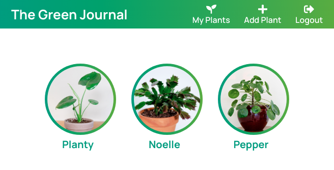

# The Green Journal
Plant parenting made easy.

## Demo
[Live App](https://green-journal-app.now.sh/)

Demo Account Login:
* username: demo_user
* password: password

## About
The Green Journal helps you keep track of your plant babies and document their big moments as they grow. 

First, create a plant profile with basic care instructions:

Next, add exciting updates about your plant as it grows:

Then, come back any time to review/update care details and relive your plant's big moments:

## Tech
* HTML5
* CSS
* JS
* React
* Express
* Node.js
* PostgresSQL
* AWS S3

## Documentation
* **A user creates an account.**  This sends a POST request to /users. The server adds the username and bcrypted password to the database after checking that the username doesn't already exist.
* **A returning user visits the landing page and logs in.**  This sends a POST request to /auth/login. The server checks in the database for the user/password and sends an authToken if username/password exists.
* **A user successfully logs in and is taken to the home page.**  This sends a GET request to /plants. The server checks in the database and sends plants with the same user id as the logged in user.
* **A user clicks on an existing plant and is taken to it's plant details page.**  This sends a GET request to /plants/:plant_id/logs. The server checks in the database and sends logs with the plant's id.
* **A user submits add plant form.**  This first sends a POST request to AWS S3 that uploads the image and sends back a url for the image. The image url is inserted into the plant object that is then sent in the body of a POST request to /plants. The server adds the plant to the database.
* **A user submits edit plant form.**  If there is an image to upload, this first sends a POST request to AWS S3 that uploads the image and sends back a url for the image. The image url is inserted into the plant object that is then sent in the body of a PATCH request to /plants. The server updates the plant in the database.
* **A user clicks delete plant button.**  This sends a DELETE request to /plants. The server deletes the plant and any associated logs in the database.
* **A user submits add log form.**  If there is an image to upload, this first sends a POST request to AWS S3 that uploads the image and sends back a url for the image. The image url is inserted into the log object that is then sent in the body of a POST request to /logs. The server adds the log to the database.
* **A user clicks delete log button.**  This sends a DELETE request to /logs. The server deletes the log in the database.

## API
[Repo](https://github.com/sloach1218/green-journal-api)